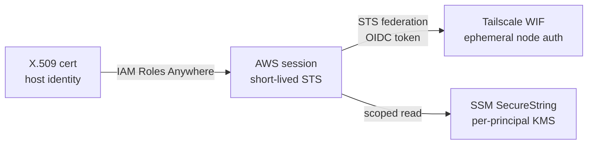

# Keyless Credentials

How an OpenAB host can hold **zero standing credentials** — no long-lived AWS key, no standing Tailscale auth-key, no GitHub PAT sitting on disk — and still reach every resource it needs. Instead of storing secrets, the host proves *who it is* and exchanges that identity for a short-lived token at each border it crosses.

This is a deployment pattern, not an OpenAB built-in. OpenAB itself resolves its own bot tokens and API keys through the [secret providers](../04-decision-trees/secrets-strategy.md) — this doc is about the layer *underneath*: how the host or agent obtains those credentials (and AWS / network access) without a permanent key to leak.

## The Problem With Stored Keys

Every long-lived credential is a liability with three costs:

- **Blast radius** — a leaked AWS access key or PAT works until someone notices and rotates it.
- **Rotation toil** — someone (or some cron) has to rotate, redistribute, and audit.
- **Storage risk** — the key has to live *somewhere*, and every somewhere is an attack surface.

The keyless model removes the standing secret entirely. The only thing on the host is a short-lived identity document that expires on its own.

## The Pattern: Identity → Federation → Short-Lived Token

Each border (AWS, tailnet, GitHub) accepts a *trusted, time-boxed credential* rather than a stored key. The host presents proof of identity; the border issues a token that self-expires.

- **Leg A — X.509 → AWS.** [IAM Roles Anywhere](https://docs.aws.amazon.com/rolesanywhere/latest/userguide/introduction.html) trades a certificate (issued by a trusted CA) for a short-lived AWS session. No `aws_access_key_id` on the host.
- **Leg B — AWS → network.** AWS STS issues an OIDC token; Tailscale Workload Identity Federation exchanges it for an ephemeral tailnet node auth. SSH login is then gated by tailnet ACLs — no stored SSH key, no standing auth-key.
- **Leg C — scoped storage.** Anything that genuinely *must* be stored (a bootstrap secret) lives in SSM SecureString under a per-principal KMS grant, so a compromised host reads only its own secrets, and every access is logged in CloudTrail.

## Where Your Host Starts

The entry point depends on what identity the host already has:

| Scenario | Starting point | First step |
|----------|---------------|-----------|
| Off-cloud host | X.509 cert only | IAM Roles Anywhere (Leg A) |
| AWS-native (EC2 / ECS / Lambda) | Instance/task role | Use the role directly — skip Leg A |
| Already has AWS creds | Existing session | Federate outward (Leg B) |
| Non-AWS target | AWS OIDC token | Exchange at the target's federation endpoint |

## Maturity — What's Real Today

Being explicit about what ships versus what's proposed:

| Piece | Status |
|-------|--------|
| IAM Roles Anywhere → AWS session | **Today** — GA AWS feature |
| STS outbound federation → Tailscale WIF | **Today** — both sides GA |
| SSM SecureString + per-principal KMS | **Today** |
| Unified credential broker across providers | **Proposed** — GitHub-focused today; pluggable-provider design under discussion |

## Gotchas

- **Regional endpoint.** `GetWebIdentityToken` (STS outbound federation) must be called against a regional STS endpoint, not the global one — the global endpoint doesn't serve it.
- **No duration / audience condition keys yet.** As of writing you can't pin token lifetime or audience via IAM condition keys on the federation call — scope with the role's own trust policy instead.
- **The CA key is the new crown jewel.** You removed the standing access key, but the CA that signs the X.509 certs is now the single high-value secret. Protect it accordingly (HSM / KMS-backed, tight access, audited).

## Further Reading

- Worked reference implementation: [jonatw/flightdeck — keyless-clearance](https://github.com/jonatw/flightdeck/blob/main/docs/foreign-policy/keyless-clearance.md) (full end-to-end setup, sequence diagram, and rationale)
- [Trust Model](../01-core-concepts/trust-model.md) — how OpenAB isolates its *own* secrets from agents
- [Secrets Strategy](../04-decision-trees/secrets-strategy.md) — where to store the secrets OpenAB still needs
- AWS: [IAM Roles Anywhere](https://docs.aws.amazon.com/rolesanywhere/latest/userguide/introduction.html)
