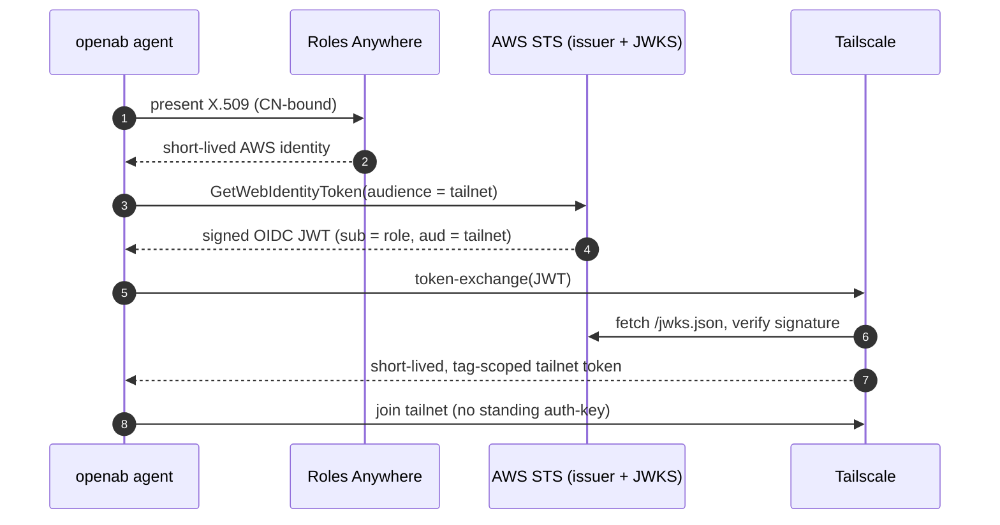
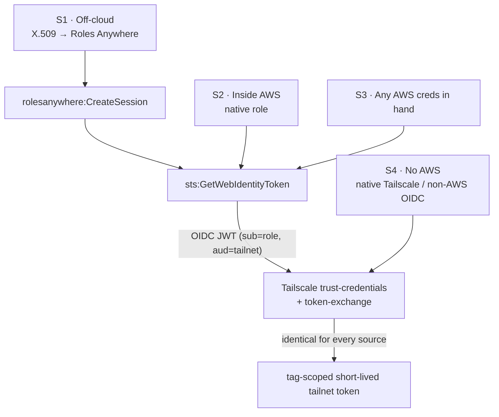

# Keyless Access for Off-Cloud Agents

An openab agent running outside AWS can obtain scoped, short-lived credentials for AWS, a Tailscale tailnet, and GitHub without storing any long-lived secret in the container — no static access key, no tailnet auth-key, no GitHub PAT. Each credential is minted on demand and expires on its own.

This is a community-contributed pattern, not an openab-official standard. It layers on top of openab: openab stays the thin broker, and credential identity is owned in the layer above it. Roadmap items are tagged **[Today]** / **[Proposed]** / **[Vision]** so nothing aspirational reads as shipped.

**Scope of "keyless."** No long-lived shared secret lives in the runtime. Trust still rests on durable controls configured out-of-band — an X.509 trust anchor, IAM role trust policies, KMS key policies, and broker/tailnet config. Only the credential the agent actually holds is short-lived and scoped. (A stricter term is *long-lived-secretless*.)

## The problem

Attaching a long-lived AWS access key to a machine creates a credential that never expires, is trivially copied, can leak in a commit, and gives no signal about which host lost it. The same applies to a static Tailscale auth-key or a GitHub PAT baked into a container. This pattern removes all three from the runtime and replaces them with short-lived, scoped, verifiable tokens.

## The credential chain (off-cloud → AWS → tailnet)

An off-cloud agent reaches a tailnet in three legs:

1. **AWS identity — IAM Roles Anywhere.** A self-managed private CA is registered as a trust anchor. The agent presents a short-lived X.509 certificate (private key ideally TPM-sealed); `aws_signing_helper` calls `rolesanywhere:CreateSession` and receives a short-lived AWS identity. The role is bound to the certificate's Common Name.
2. **OIDC token — AWS STS.** STS Outbound Identity Federation (GA 2025) makes the AWS account an OIDC issuer with a public JWKS. The AWS identity calls `sts:GetWebIdentityToken --audience <tailnet>` and receives a signed JWT (`sub` = role, `aud` = tailnet). The signing key never leaves AWS's HSM. This replaces the older self-hosted KMS/Lambda OIDC broker.
3. **Tailnet token — Tailscale WIF.** The tailnet is configured (trust-credentials) to trust the account's issuer URL. Its token-exchange endpoint verifies the JWT against the JWKS, matches `sub`/`aud`, and returns a short-lived, tag-scoped tailnet token. No standing auth-key is stored.



## Credential sources are pluggable

Only the first leg differs by where the agent runs; the tailnet side is identical for every source. Swapping the source is swapping a `CredentialBackend` — the abstraction proposed in RFC https://github.com/openabdev/octobroker/issues/54.



- **S1 — Off-cloud (X.509 → Roles Anywhere).** The general case: works anywhere and binds to hardware under your control. **[Today]**
- **S2 — Inside AWS (native role).** A Fargate/EC2/Lambda/SSO identity skips leg 1 — fewest moving parts. **[Today]**
- **S3 — Any AWS credential already in hand.** Any SigV4-signable principal can start at leg 2; useful when migrating off a legacy static key. **[Today]**
- **S4 — No AWS (native Tailscale OAuth or non-AWS OIDC).** Uses Tailscale's own OAuth/auth-key or a non-AWS OIDC issuer (GitHub Actions, GCP, Azure). Skips AWS entirely; trades away AWS identity as a common hub. **[Today]**

| Agent runs… | Credential | Own CA? | AWS? | Keyless? | Tailnet side |
|---|---|---|---|---|---|
| Off-cloud | X.509 → Roles Anywhere *(S1)* | yes | yes | ✔ | **identical** |
| Inside AWS | native AWS role *(S2)* | no | yes | ✔ | **identical** |
| Anywhere w/ AWS creds | existing token *(S3)* | no | yes | ✔/△ | **identical** |
| Anywhere, no AWS | Tailscale / non-AWS OIDC *(S4)* | no | no | ✔ | **identical** |

## Persisting the few inputs that must survive

Some mint-time inputs (audience, tailnet client-id) must persist. SSM Parameter Store SecureString with a scoped role is sufficient — a KMS-encrypted, path-scoped, audited static carrier:

- **Path-scoped decryption.** Path-based IAM (`Resource: …:parameter/prefix-*`) plus a per-principal KMS grant means each principal decrypts only its own parameters — two independent checks (`ssm:GetParameter*` **and** `kms:Decrypt`).
- **No native rotation.** Parameter Store does not rotate (that is Secrets Manager). Its dynamic levers are parameter policies (TTL/expiration + EventBridge, Advanced tier) and versioning.
- **Scoped minting.** Scoping which parameters a role may decrypt scopes which tokens it may mint. The ephemeral parts (JWT, tailnet token) remain short-lived by construction via STS/Tailscale.

A hardened variant provisions per-application customer-managed KMS keys (replacing the default SSM key), grants each task role `kms:Decrypt` on only its own key, and alerts (EventBridge + SNS) on any read by a non-agent principal. This favours SSM SecureString over Secrets Manager: cheaper, KMS-isolated, path-scoped, and audited, accepting "no native rotation" as the trade. **[Today]**

## Reference configuration

One working Roles Anywhere setup for an always-on host that holds a read-only AWS role and also mints tailnet tokens. This is a reference, not a prescribed standard.

- **Self-managed CA:** private key kept offline; only the public CA certificate is registered as a `CERTIFICATE_BUNDLE` trust anchor.
- **Leaf certificate:** `CN=host-01`, ~90-day validity; key never leaves the host.
- **Role trust bound to the CN:** `aws:PrincipalTag/x509Subject/CN == host-01`, plus `sts:TagSession` and `sts:SetSourceIdentity`.
- **Permissions:** `ViewOnlyAccess` baseline plus named read-only diagnostics (CloudTrail LookupEvents, Logs read, Cost Explorer, Batch describe).
- **Explicit deny on secret-read and role-pivot:** `ssm:GetParameter*`, `secretsmanager:GetSecretValue`, `kms:Decrypt`, `s3:GetObject`, `sts:AssumeRole*`.
- **Tailnet minting grant:** `sts:GetWebIdentityToken`. This action is **outside** the `AssumeRole*` family, so the deny above does not cover it — review it separately.
- **Profile:** 1-hour sessions. **Renewal:** a scheduled check flags leaf expiry. **Revocation:** disabling or deleting the trust anchor invalidates every leaf at once.

```python
# CDK (trimmed; account/ARNs redacted)
anchor = ra.CfnTrustAnchor(self, "FleetCaAnchor", name="fleet-ca", enabled=True,
    source=ra.CfnTrustAnchor.SourceProperty(
        source_type="CERTIFICATE_BUNDLE",
        source_data=ra.CfnTrustAnchor.SourceDataProperty(x509_certificate_data=FLEET_CA_PEM)))

cn = {"StringEquals": {"aws:PrincipalTag/x509Subject/CN": "host-01"}}
role = iam.Role(self, "RaTelescope", role_name="ra-telescope-ro",
    assumed_by=iam.PrincipalWithConditions(iam.ServicePrincipal("rolesanywhere.amazonaws.com"), cn),
    managed_policies=[iam.ManagedPolicy.from_aws_managed_policy_name("job-function/ViewOnlyAccess")])
role.assume_role_policy.add_statements(iam.PolicyStatement(
    actions=["sts:TagSession", "sts:SetSourceIdentity"],
    principals=[iam.ServicePrincipal("rolesanywhere.amazonaws.com")], conditions=cn))
role.add_to_policy(iam.PolicyStatement(sid="TailscaleWIF",
    actions=["sts:GetWebIdentityToken"], resources=[f"arn:aws:sts::{self.account}:self"]))  # mint only for self
role.add_to_policy(iam.PolicyStatement(sid="DenySecretsAndPivot", effect=iam.Effect.DENY,
    actions=["ssm:GetParameter","ssm:GetParameters","ssm:GetParametersByPath",
             "secretsmanager:GetSecretValue","kms:Decrypt","s3:GetObject",
             "sts:AssumeRole","sts:AssumeRoleWithSAML","sts:AssumeRoleWithWebIdentity"],
    resources=["*"]))
profile = ra.CfnProfile(self, "RaProfile", name="ra-telescope-ro",
    enabled=True, duration_seconds=3600, role_arns=[role.role_arn])
```

> **Note (field-verified):** the audience/duration condition keys (`sts:IdentityTokenAudience`, `sts:DurationSeconds`) were not present in this API's request context, so a condition lock on them fails **closed**. Until AWS ships them, bound the risk with `resource: sts::<account>:self` and a single-purpose role.

## Broker integration (Today / Proposed / Vision)

- **[Today]** openab's broker (octobroker) runs the GitHub border. The agent presents one key (`X-Octobroker-Key`); the broker checks a default-deny allowlist and mints a fresh ~1-hour GitHub App installation token, narrowed at mint time to exact repositories and a minimal permission envelope (a git-push credential gets only `contents:write`). GitHub enforces both boundaries; the App private key never leaves the broker; every issuance is audit-logged. No agent holds a PAT. *(Verified against `src/app_token.rs` in https://github.com/openabdev/octobroker.)*
- **[Proposed]** RFC https://github.com/openabdev/octobroker/issues/54 extracts `CredentialBackend` / `UpstreamClient` / `PolicyClassifier`, so GitHub becomes the first backend rather than the only hardcoded one. It is a pure refactor with byte-identical wire behaviour — it ships the extension points, not a second provider.
- **[Vision]** On those extension points, a tailnet/AWS backend could run the three-leg chain above behind the same broker interface, allowlist, and audit log. **Status:** openab has not adopted this as a universal broker — its secret surface (GitHub App keys, Tailscale credentials, AWS identities) is broader than GitHub tokens, so today it runs a scoped SSM vault plus Roles Anywhere. A unified broker is an open design direction, not a plan. **Cost:** every new backend is a new trust-critical surface that must inherit the same default-deny and audit invariants and be reviewed as carefully as the GitHub one.

## Runbook

```bash
# One-time per account: turn STS into a recognised OIDC issuer
aws iam enable-outbound-web-identity-federation
aws iam get-outbound-web-identity-federation-info
#   → IssuerUrl https://<unique-id>.tokens.sts.global.api.aws  (+ /.well-known/openid-configuration, /jwks.json)

# Agent already holding an AWS identity (via S1/S2/S3): mint an OIDC JWT, then exchange for a tailnet token
export AWS_STS_REGIONAL_ENDPOINTS=regional      # GetWebIdentityToken is NOT on the STS global endpoint (else InvalidAction)
aws sts get-web-identity-token \
  --audience "api.tailscale.com/<client-id>" \
  --query WebIdentityToken --output text > travel.jwt

curl -s https://api.tailscale.com/api/v2/oauth/token-exchange \
  -d grant_type=urn:ietf:params:oauth:grant-type:token-exchange \
  -d subject_token="$(cat travel.jwt)" \
  -d subject_token_type=urn:ietf:params:oauth:token-type:jwt
# — OR, Tailscale client v1.90.1+ —
tailscale up --client-id="<client-id>" --id-token="$(cat travel.jwt)" --advertise-tags="tag:openab-agent"
```

**Tailscale trust-credentials:** set `Issuer` = the account IssuerUrl, `Audience` = `api.tailscale.com/<client-id>`, `Subject` = the exact role ARN (no wildcards), and assign minimal `Tags` and `Scopes`.

## Blast radius and residual risk

From adversarial review — stated plainly rather than assumed away:

- **CA private-key compromise is the sharpest risk.** If the CA private key leaks, an attacker can forge an X.509 with `CN=host-01`; CN-binding does not stop a CA-key holder. Mitigation: keep the CA key offline; stronger, in an HSM. Contain with short-lived leaves and immediate trust-anchor disable/delete.
  - **Hardening (evaluated):** back the CA with an AWS KMS asymmetric key (~$1/month) — the signing key lives in a FIPS 140-2 L3 HSM and is non-exportable, so there is no key file to steal; compromise then requires `kms:Sign`, which is CloudTrail-audited and IAM-revocable, and is ~400× cheaper than AWS Private CA (~$400/month). `step-ca` supports a KMS signer directly. **Trade-off:** still no real-time per-leaf revocation — but Roles Anywhere honours imported CRLs only (no OCSP) regardless, so lean on short-lived leaves and kill the whole CA instantly.
- **Bearer-token replay.** The JWT and the tailnet token are bearer credentials; keep both lifetimes minimal. The IAM lever to *enforce* a short cap (`sts:DurationSeconds`) is not yet available, so today the cap is procedural.
- **Audience-lock gap.** Until the audience condition key ships, the minting role may request a token for any `aud`. Bound it with `resource: sts::<account>:self` and use one minting role per audience — never shared. Pin Tailscale's `Subject` to the exact role ARN.
- **Tag scope.** A tailnet tag grants access; keep it minimal (`tag:openab-agent-ro`, not `tag:prod-*`).
- **Trust assumption (accepted).** Verification rests on AWS's HTTPS-served JWKS being authentic — the standard OIDC trust root; JWKS compromise or key-rotation lag is an AWS-managed risk.

## Component reference

| Component | Maturity |
|---|---|
| Private CA registered as a Roles Anywhere **trust anchor** | Today |
| Short-lived **X.509** leaf (`CN=host-01`, TPM-sealable) | Today |
| `aws_signing_helper` → `rolesanywhere:CreateSession` | Today |
| AWS STS **Outbound Identity Federation** (issuer + JWKS) | Today |
| Signed **OIDC JWT** from `sts:GetWebIdentityToken` | Today |
| Tailscale **trust-credentials** + **token-exchange** | Today |
| Tag-scoped, short-lived **tailnet token** | Today |
| **SSM SecureString** + per-principal KMS + audit | Today |
| openab broker (octobroker), GitHub backend + default-deny allowlist | Today |
| Backend traits `CredentialBackend` / `UpstreamClient` / `PolicyClassifier` | Proposed (octobroker#54) |
| Tailnet/AWS broker backend | Vision |

## Related

- [Run a Governed Community Bot](./run-a-governed-community-bot.md)
- [Deploy Multiple Agents](./deploy-multi-agent.md)
- [Hook Into the Lifecycle](./hook-into-lifecycle.md)
- [What is OpenAB](../00-what-is-openab.md) — the thin-broker, "own the layers above" philosophy this pattern builds on.

## Sources (official; cross-checked)

- IAM Outbound Web Identity Federation — https://docs.aws.amazon.com/IAM/latest/UserGuide/id_roles_providers_outbound-federation.html
- STS `GetWebIdentityToken` — https://docs.aws.amazon.com/STS/latest/APIReference/API_GetWebIdentityToken.html
- Tailscale Workload Identity Federation — https://tailscale.com/kb/1317/workload-identity-federation
- IAM Roles Anywhere trust model — https://docs.aws.amazon.com/rolesanywhere/latest/userguide/trust-model.html
- IAM Roles Anywhere credential helper — https://docs.aws.amazon.com/rolesanywhere/latest/userguide/credential-helper.html
- AWS KMS asymmetric keys — https://aws.amazon.com/kms/faqs/
- octobroker — https://github.com/openabdev/octobroker
